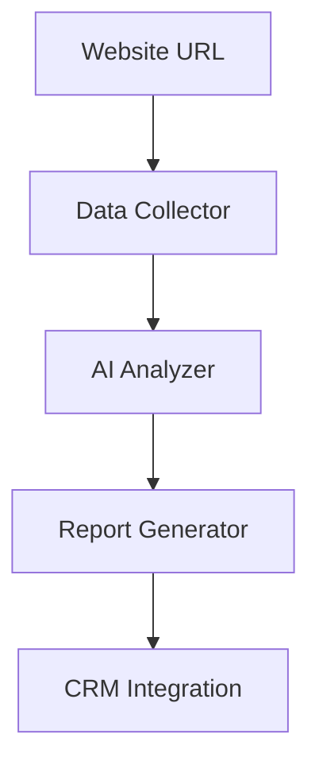

# AI Prospect Research System


> An enterprise-grade automation system that transforms company research using AI and web intelligence.

## Table of Contents
- [Overview](#overview)
- [Features](#features)
- [Technical Stack](#technical-stack)
- [Installation](#installation)
- [Usage](#usage)
- [Configuration](#configuration)
- [Architecture](#architecture)
- [Best Practices](#best-practices)
- [Documentation](#documentation)
- [Contributing](#contributing)
- [Support](#support)

## Overview

Transform your sales team's research workflow with our AI-powered prospect analysis system. Automatically extract, analyze, and generate comprehensive company profiles from just a website URL.

### Key Features
- 🤖 Advanced AI Analysis (GPT-4)
- 🌐 Multi-source Data Integration
- 📊 Intelligent Market Analysis
- 📋 Automated Report Generation
- 🔄 CRM Integration
- ⚡ Concurrent Processing

## Technical Stack

### Core Technologies
- Python 3.8+
- OpenAI GPT-4
- BeautifulSoup4
- Concurrent Processing

### Data Sources
- Company Websites
- LinkedIn API
- Crunchbase API
- News APIs

### Integrations
- CRM Systems
- Reporting Tools
- Notification Systems

## Installation

```bash
# Clone the repository
git clone https://github.com/username/ai-prospect-research.git
cd ai-prospect-research

# Install dependencies
pip install -r requirements.txt

# Configure your API keys
cp config.example.json config.json
```

## Usage

```python
from prospect_workflow import ProspectWorkflow

# Initialize the workflow
workflow = ProspectWorkflow(config_path="config.json")

# Analyze a company
result = workflow.process_company("https://example.com")

# Generate report
print(result['profile'])
```

## Configuration

```json
{
    "api_keys": {
        "openai": "your-key",
        "linkedin": "your-key",
        "crunchbase": "your-key"
    },
    "crm": {
        "type": "salesforce",
        "credentials": {
            "api_key": "your-key"
        }
    }
}
```

## Architecture

### Data Collection Layer
- Intelligent web scraping
- API data enrichment
- News aggregation
- Social media metrics

### AI Analysis Layer
- Company profile generation
- Market position assessment
- Growth opportunity identification
- Risk analysis

### Report Generation Layer
- Executive summaries
- Detailed analysis
- Visual metrics
- CRM integration



## Best Practices

### API Usage
- Implement rate limiting
- Handle throttling gracefully
- Cache responses appropriately

### Error Handling
- Graceful degradation
- Comprehensive logging
- Automatic retry mechanisms

## Documentation

Detailed documentation is available in the `/docs` directory:
- [API Reference](docs/api.md)
- [Configuration Guide](docs/config.md)
- [Development Guide](docs/development.md)

## Roadmap

- [ ] Add sentiment analysis
- [ ] Implement competitor comparison
- [ ] Add industry benchmarking
- [ ] Enhance visual reporting
- [ ] Add real-time monitoring

## Contributing

1. Fork the repository
2. Create your feature branch
3. Commit your changes
4. Push to the branch
5. Create a Pull Request

## Support

- **Documentation:** [Full Documentation](docs/index.md)
- **Issues:** [GitHub Issues](https://github.com/username/ai-prospect-research/issues)
- **Email:** yanpcotta@gmail.com

## Acknowledgments

- OpenAI for GPT-4 API
- Beautiful Soup contributors
- Python community

